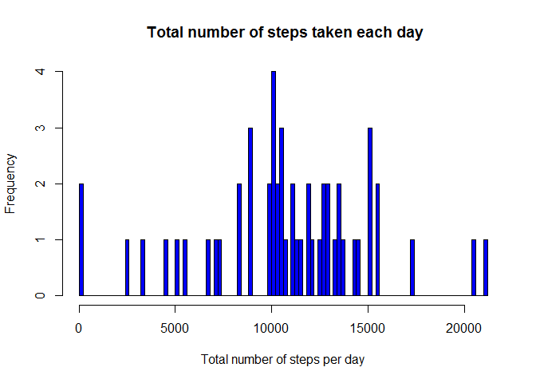
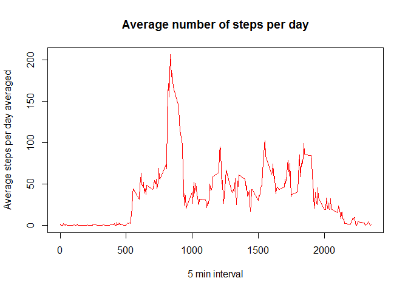
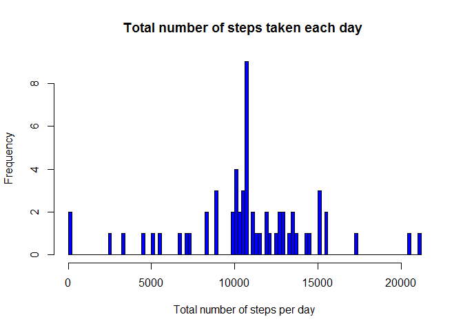
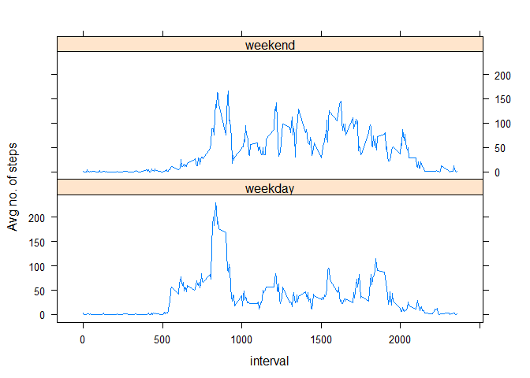

## R Markdown

This assignment makes use of data from a personal activity monitoring device. This device collects data at 5 minute intervals through out the day. The data consists of two months of data from an anonymous individual collected during the months of October and November, 2012 and include the number of steps taken in 5 minute intervals each day.

The data for this assignment can be downloaded from the course web site:  
**Dataset:** [URL](https://d396qusza40orc.cloudfront.net/repdata%2Fdata%2Factivity.zip)


```r
library(dplyr)
library(lubridate)
library(lattice)
```


```r
temp <- tempfile()
download.file("https://d396qusza40orc.cloudfront.net/repdata%2Fdata%2Factivity.zip",temp)
data <- tbl_df(read.csv(unz(temp, "activity.csv")))
unlink(temp)
data$date <- ymd(data$date)
```
## What is mean total number of steps taken per day?

```r
Steps_Per_Day <- aggregate(steps~date,data=data,sum,na.rm=TRUE)
hist(Steps_Per_Day$steps,breaks =100, xlab = "Total number of steps per day", col=4, main=" Total number of steps taken each day")
```

<!-- -->

```r
mean_of_steps <- round(mean(Steps_Per_Day$steps))
mean_of_steps
```

```
## [1] 10766
```

```r
median_of_steps <-  median(Steps_Per_Day$steps)
options("scipen" = 10)
options()$scipen
```

```
## [1] 10
```

**The mean of total number of steps per day is ``10766``**
**The median of total number of steps per day is ``10765``**


## What is the average daily activity pattern?

```r
daily_activity_pattern<- tapply(data$steps,data$interval,mean,na.rm=TRUE)

plot(row.names(daily_activity_pattern), daily_activity_pattern, type = "l", col = "2",
     xlab = "5 min interval",  ylab = "Average steps per day averaged",
     main = "Average number of steps per day")
```

<!-- -->


```r
max_interval <- which.max(daily_activity_pattern)
```

**The maximum 5-min interval that contains the maximum number of steps is 835**

## Imputing missing values


```r
count_of_missing_values <- sum(is.na(data))
```
**The total number of missing values is 2304**


```r
Average_Steps <- aggregate(steps ~ interval, data= data, FUN = mean)
MissingValueFilling <- numeric()
for (i in 1:nrow(data)) {
    data2 <- data[i, ]
    if (is.na(data2$steps)){
        steps <- subset(Average_Steps, interval == data2$interval)$steps
    } else{
        steps <- data2$steps
    }
    MissingValueFilling <- c(MissingValueFilling, steps)
}
```


```r
new_data_fill <- data
new_data_fill$steps <- MissingValueFilling
count_of_NAs <- sum(is.na(new_data_fill))
```
**The total number of NAs in the new data set is ``0``**


```r
Steps_Per_Day2 <- aggregate(steps~date,data=new_data_fill,sum,na.rm=TRUE)
hist(Steps_Per_Day2$steps,breaks =100, xlab = "Total number of steps per day", col=4, main = "Total number of steps taken each day ")
```

<!-- -->

```r
new_data_mean <- round(mean(Steps_Per_Day2$steps))
new_data_median <- round(median(Steps_Per_Day2$steps))
```

**The mean for the new data set is ``10766`` which is equal to the old data mean ``10766``**
**The mean for the new data set is ``10766`` which is greater than the old data median ``10765``**

## Differences in activity patterns between weekdays and weekends


```r
new_data_fill$day <- factor(format(new_data_fill$date, "%A"))
levels(new_data_fill$day) <- list(weekday = c("Monday","Tuesday", "Wednesday", "Thursday", "Friday"),
                                  weekend = c("Saturday", "Sunday"))
AvgStepsAcrossDays <- aggregate(new_data_fill$steps,
                                list(interval = as.numeric(as.character(new_data_fill$interval)),
                                day = new_data_fill$day), FUN=mean)
names(AvgStepsAcrossDays)[3] <- "steps"
xyplot(AvgStepsAcrossDays$steps ~ AvgStepsAcrossDays$interval | AvgStepsAcrossDays$day, 
       layout =c(1,2), type="l",xlab="interval", ylab="Avg no. of steps")
```

<!-- -->


